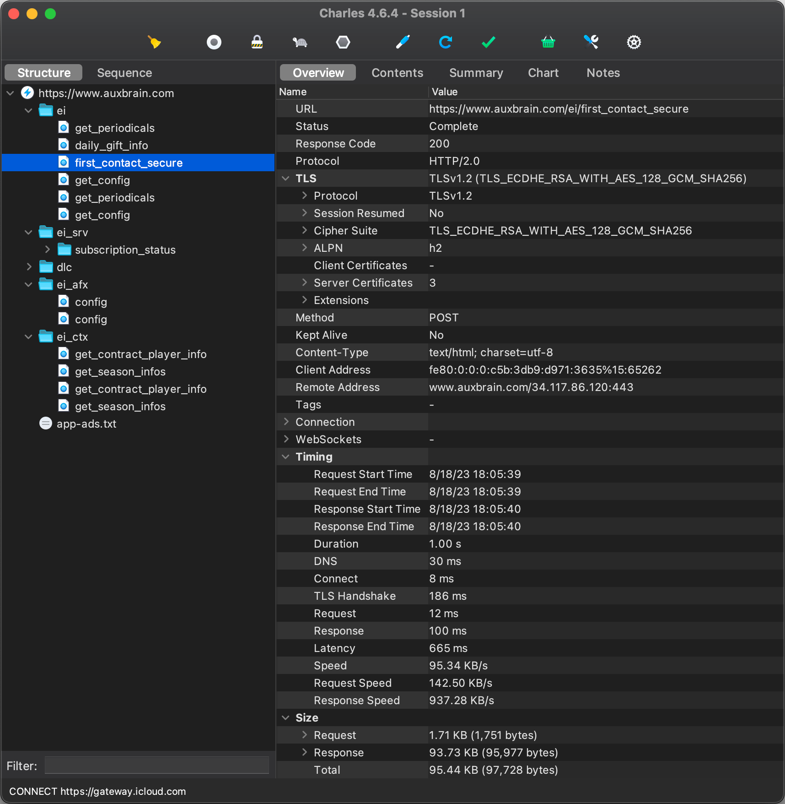
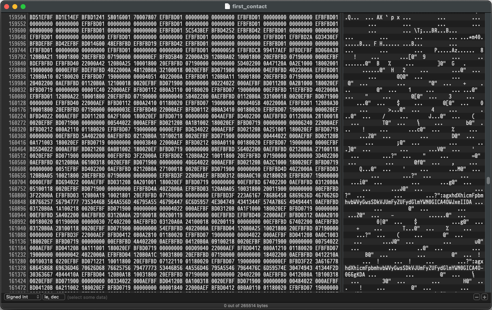

To make a Discord bot to help organize co-op teams in Egg, Inc., I needed to get data from the game. There are no
documented APIs, so I was going to have to reverse engineer the game’s network traffic.

## Charles Proxy

[Charles Proxy](https://www.charlesproxy.com/) allows you to intercept network traffic. You can even use it
to [intercept encrypted HTTPS traffic from your iPhone](https://www.charlesproxy.com/documentation/using-charles/ssl-certificates/).
Perfect! So I set up my iPhone to use Charles Proxy as a proxy server, and started the game.



Whenever I opened the game, I would see a number of requests and responses. The response to `/ei/first_contact` had
almost 100kb of Base64-encoded data. The rest of the traffic didn’t look half as interesting, and when I started there
was probably not even half of what is shown in the screenshot.

After decoding, it was still mostly unintelligible, but slightly less so. It was in a binary format, so I grabbed a hex
editor and started looking for patterns.

## Protobuf

As you can see in the image below, there are some repeating patterns. At the start of the file I could see my in-game
name, and my iCloud ID. I was on the right track.



There was a lot of data, but I couldn’t make sense of most of it. I had seen APIs use JSON or XML, but I’d never seen
anything like this before. And since I did see my name and iCloud ID, I knew I wasn’t looking at encrypted data.

After a little bit of research, I figured out that the data was probably serialized
using [Protocol Buffers](https://protobuf.dev). This is a binary format for serializing structured data. It competes
with the likes of JSON and XML, but is much more compact and faster to parse. However, it is not human-readable.

To make sense it you need a Protocol buffer definitions file. These `.proto` files contain the structure of the data,
called *messages*. They define the names and types of the data, which a program uses to encode outgoing and decode
incoming messages. For example, a message could be defined as follows:

```protobuf
message User {
  required int32 id = 1;
  required string name = 2;
  repeated Post posts = 3;
}

message Post {
  required string title = 1;
  required string content = 2;
}
```

Without a definitions file, you only have two pieces of information: a sequence number and the raw bytes of data.
You don’t even know how to interpret the data; whether it’s a `string`, an `int32` or something else. It’s the
sequence number that links the data to the definitions file and tells the program how to interpret it. This is the
purpose of the `= 1` and `= 2` in the example above.

## Reverse engineering

To get the data in a state I could work with, I started the process of reverse engineering the Protocol buffer
definitions file. First, I started by looking for patterns in the response data. I noticed that there were a
lot of bytes that were appearing in a certain cadence.

There were a lot of blank chunks, just bytes of zeroes, intermingled with consistent structures with repeating elements,
where I had also noticed a number that increased by one each time. This is our sequence number!

I can’t remember how I figured out the message boundaries and types, but this is a snippet of the first
iteration of my `egginc.proto` file:

```protobuf
message msg7 {
  int32 unknown1 = 1; // 17 for me, highest egg reached or something?
  uint64 ge_total = 2;
  uint32 ge_spent = 3;
  uint64 soul_eggs = 4;
  double prestige_earnings = 5;
  double lifetime_earnings = 6;
  uint32 piggy_bank = 7;
  uint32 unknown8 = 8;
  repeated name_level epic_research = 9;
  double unknown10 = 10; // looks like a timestamp
  repeated name_level newspaper = 11;
  double unknown12 = 12; // looks like a timestamp
  double unknown13 = 13;
  double video_expire_time = 14; // looks like a timestamp
  repeated name_level achievement = 15;
  uint32 unknown16 = 16;
  uint32 unknown17 = 17;
  repeated uint32 unknown18 = 18; // "highest amount of chickens obtained on that egg"
  repeated uint32 unknown19 = 19; // "level of trophy obtained for their respective eggs"
  uint32 unknown20 = 20; // related to daily gift "day"
  uint64 unknown23 = 23;
  uint32 unknown24 = 24;
  uint32 unknown25 = 25;
  double unknown26 = 26;
  double unknown27 = 27;
}
```

After a while I realized that I wasn’t going to be able to wade through almost 100,000 bytes of raw binary data by hand.
I would have to find a way to get a Protobuf definitions file somehow.

Any application that serializes and deserializes Protobuf messages needs to have the definition of the messages
somewhere. Egg, Inc. is available on both the [App Store](https://apps.apple.com/us/app/egg-inc/id993492744) and
the [Google Play Store](https://play.google.com/store/apps/details?id=com.auxbrain.egginc). This means that I could look
for the Android app’s APK[^1] file, which I downloaded and extracted.

Unfortunately, there was no ready-made `egginc.proto` file to be found. The definitions _had_ to be there somewhere, so
I was going to have to dig a little deeper. There were a few compiled Android Library (`.so`) files that looked
interesting, so I grabbed my hex editor again and loaded up those files.


When looking through `libegginc.so`, I saw the string `ei.proto` (highlighted in the image above). I struck gold!
Everything was here! Message names, property names, types (represented by a number), everything!

With some good old Regex I
wrote [a tool](https://github.com/pindab0ter/EggBot/blob/9feb33358f31483a292383ba4903fb114d94343a/src/main/kotlin/nl/pindab0ter/eggbot/utilities/ProtoExtractor.kt)[^2]
to help me parse the data.

```kotlin
const val START = "ei.proto\u0012\u0002ei\u001A\u000Ccommon.proto"
const val END = "\u0000\u0000\u0000\u0000"

val componentPattern = """\x0A.{0,2}?(?<name>[A-Za-z]+)(?<body>.*?)(?=\x0A.[A-Z][a-z]|$)"""
    .toRegex(DOT_MATCHES_ALL)
val classPattern = """[a-z\d_]{3,}"""
    .toRegex()
val propertyPattern = """\x0A.(?<name>\w+).(?<index>.).*?(?<repeated>.)\x28(?<primitive>.)(?:\x32.\..+?\.(?<reference>[A-Za-z.]*))?"""
    .toRegex(DOT_MATCHES_ALL)
val constantPattern = """(?<name>[A-Z_]{2,})\x10(?<index>.).*?(?:\x0A|$)"""
    .toRegex(DOT_MATCHES_ALL)

// …

fun Int.toType(): String = when (this) {
    1 -> "double"
    2 -> "float"
    5 -> "int32"
    4 -> "uint64"
    8 -> "bool"
    9 -> "string"
    13 -> "uint32"
    else -> "??? ($this)"
}

// …
```

It took me a lot of time to get the Regex right and to get the types down from the numbers. I also had to figure out
how to parse the repeated elements and where messages started and ended, but I got there in the end.

The output of this tool much more helpful than my previous attempts at reading the data by hand.

```protobuf
message Game {
  Egg max_egg_reached = 1;
  uint64 golden_eggs_earned = 2;
  uint64 golden_eggs_spent = 3;
  uint64 soul_eggs = 4;
  double prestige_cash_earned = 5;
  double lifetime_cash_earned = 6;
  uint64 piggy_bank = 7;
  uint32 permit_level = 8;
  repeated Backup.ResearchItem epic_research = 9;
  double next_daily_gift_time = 10;
  repeated Backup.NewsHeadline news = 11;
  double last_news_time = 12;
  double current_multiplier = 13;
  double current_multiplier_expiration = 14;
  repeated Backup.AchievementInfo achievements = 15;
  uint64 uncliamed_golden_eggs = 16;
  uint64 unclaimed_soul_eggs = 17;
  repeated uint64 max_farm_size_reached = 18;
  repeated uint32 egg_medal_level = 19;
  uint32 last_daily_gift_collected_day = 20;
  uint32 current_farm = 22;
  uint64 eggs_of_prophecy = 23;
  uint64 unclaimed_eggs_of_prophecy = 24;
  bool long_idle_notification_set = 25;
  double long_idle_notification_threshold = 26;
  double long_idle_reward = 27;
  uint32 num_daily_gifts_collected = 28;
  bool hyperloop_station = 29;
  repeated Backup.OwnedBoost boosts = 30;
  bool piggy_full_alert_shown = 31;
  uint32 total_time_cheats_detected = 32;
  double prestige_soul_boost_cash = 33;
  double soul_eggs_d = 34;
  double unclaimed_soul_eggs_d = 35;
  bool force_elite_contracts = 36;
  double new_player_event_end_time = 37;
}
```

As you can see, my suspicion from my first attempt that `uint32 unknown1 = 1;` represented the highest egg reached was
indeed correct. I even coupled the value of the `uint32` to the `Egg` enum that I also pulled from the library file. It
was all coming together.

### Communicating with the game servers

I set up the project so that it automatically generates classes based on the Protocol buffer definitions and use a
library to do the serialization and deserialization for me.

Every time the game launches, it synchronizes the game state with the server. This was the big response I was seeing
early on in Charles. I was able to reverse engineer a _request_ message for that initial data exchange request, and lo
and behold, the server gave me the entire game state of my Egg, Inc. game!

The next steps were clear: Create a database of player credentials to request those backups, create a Discord bot for
them to interact with, and have them start organizing co-ops with it.

> **Note:** The creators of Egg, Inc. have had to deal with cheaters in the past. Security has been much improved
> since then.
>
> B.O.C.K. has only ever sent read-only requests. Please be a decent human being and don’t cheat.

[^1]: Android Package Kit, the file format used by Android to distribute and install apps. They are basically ZIP files
containing the app’s code and resources.

[^2]: The structure of the APK has changed since writing this tool. Unfortunately, it no longer works on recent versions
of the game.
