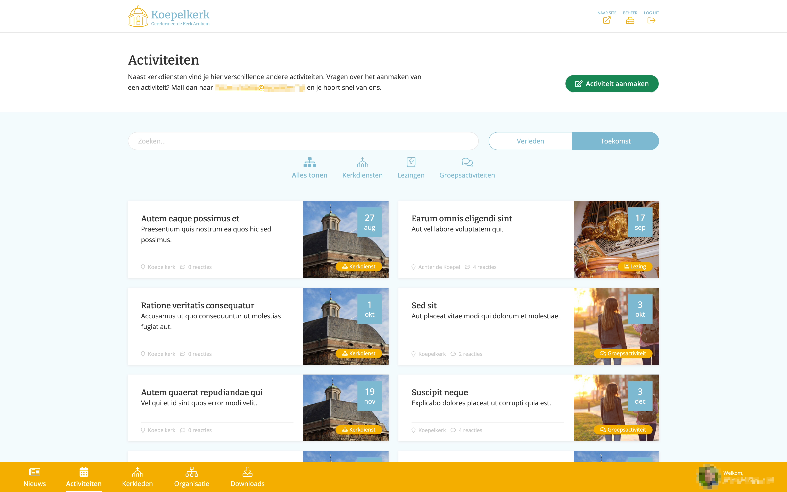
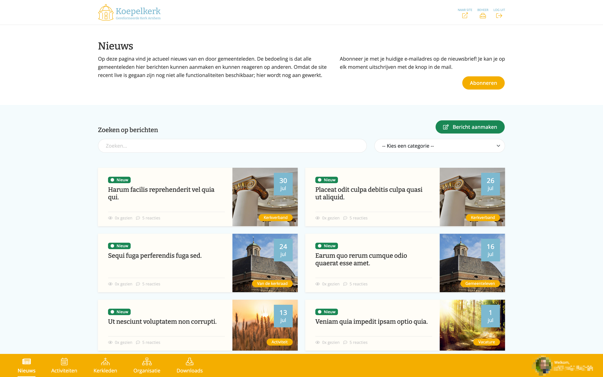
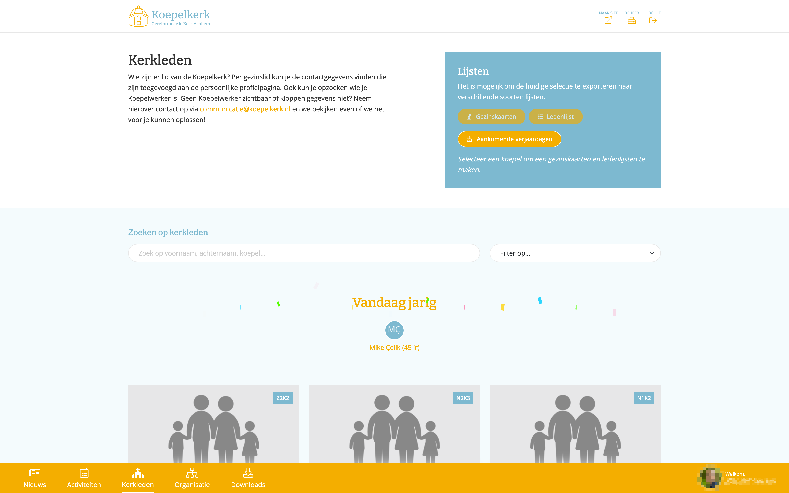
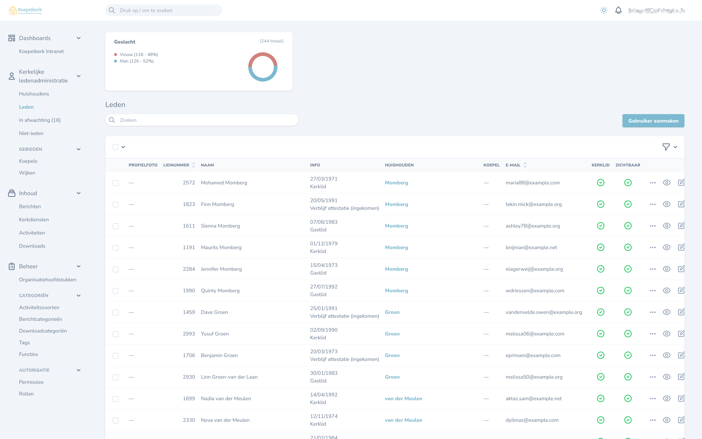
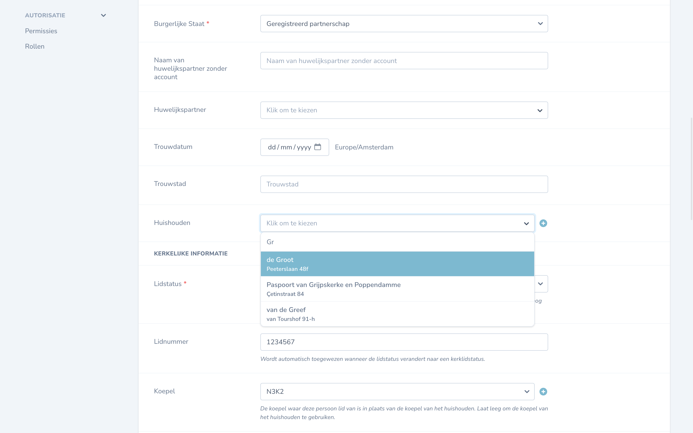
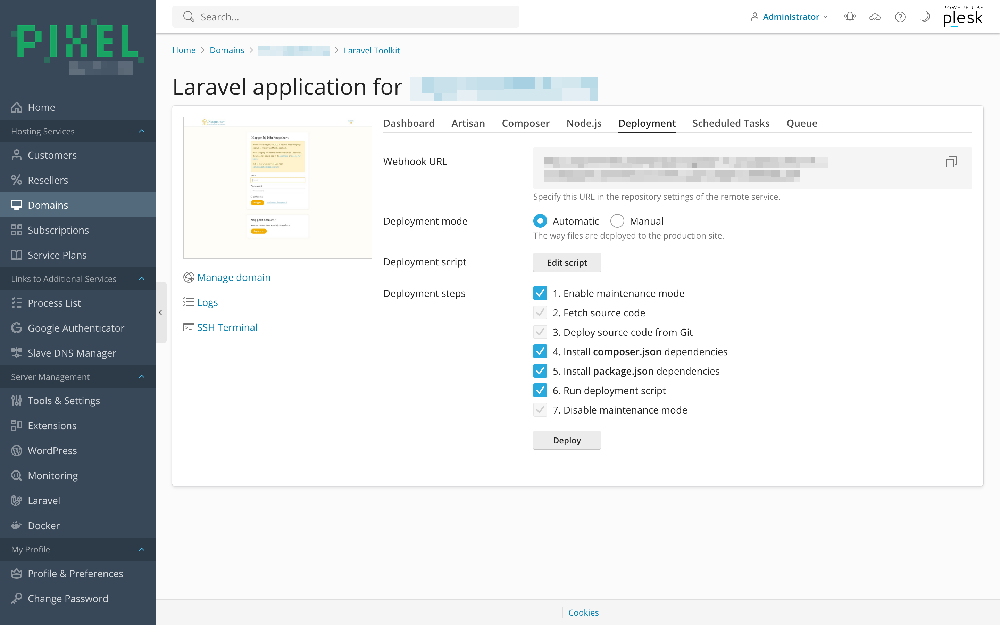

## Introduction

[Koepelkerk](https://koepelkerk.nl/) is a church congregation with over a thousand registered members in Arnhem, The
Netherlands. ‘Mijn Koepelkerk’ is the intranet for the Koepelkerk church in Arnhem.

When I joined [Pixel Creation](https://pixelcreation.nl/), this project was already being discussed. The church council
was looking for a way to share information digitally and have a platform for church members to share and organize among
themselves. Another requirement was the incorporation of the church member administration system, which at that point
was a custom program on one person’s computer, with no backup strategy and a bus factor[^1] of one.

This project was the first project I worked on at Pixel Creation. After my previous job where I worked
with [Ruby on Rails](https://rubyonrails.org/), it didn’t take me long to get used to
the [Laravel/PHP stack](https://laravel.com/). After following a quick course, I was off to the races.

> **Note:** All the data in the screenshots are test data, no personal information is being shared. I’m not discussing
> the engineering or project management aspects of the project. My then-employer has given me permission to share this.

## Front-end

Because this project would have many user-facing elements, I wanted it to have a responsive UI. The two most popular
options to achieve this are [Livewire](https://laravel-livewire.com) and [Inertia](https://inertiajs.com).

Inertia uses JavaScript components written in React, Vue or Svelte. It offers integration with major front-end
JavaScript libraries.

Livewire handles real-time updates behind the scenes while enabling the use of the
same [Blade templates](https://laravel.com/docs/10.x/blade#introduction) that Laravel uses with some additions and
controllers that are similar to Laravel controllers.

I was still getting used to Laravel, so I decided to go with Livewire. Even though Livewire still operates on different
paradigms than vanilla Laravel, it was more manageable than having to learn an entirely new front-end JavaScript library
as well.

Most of our project use Bootstrap and FontAwesome icons, so for the sake of consistency and the ability to rely on the
knowledge of my colleagues, I decided to use those as well.




## Search

The church has well over a thousand registered members that are part of household/family units, that are part of
sub-districts and districts. It was important to have good search functionality. I am very happy to report that the
combination of [Laravel Scout](https://laravel.com/docs/10.x/scout) and [Meilisearch](https://www.meilisearch.com/) was
an absolute blessing to work with.

While Laravel Scout provides a search API and integration with the Laravel models, enabling you to specify what and how
things should be indexed, for example. It was—for as far as I can gather—initially developed for use with Algolia, by
the time I started using it, the Meilisearch support was already very good. Meilisearch is an open source search engine
that you can self-host. In production, it runs in a Docker container on the same server as the Laravel instance.
Combined with Livewire, this results in a low-latency, responsive search functionality.



It was easy to configure Scout/Meilisearch to allow users to search for members or households by name, household
description (a little ‘about us’ blurb), address, phone number, first/last name of household members, member number and
even the name of the (sub-)district they are a part of.

Meilisearch has excellent and fault-tolerant fuzzy matching and weighting support. This means that even if you make
spelling mistakes, or only some parts of your query match, you still get valuable search results. This worked like a
dream.

## Admin pages

The domain was quite large, with members, households, (sub)districts, groups, news, events, church services
and so on. Not only that, but the admin pages would also be where the church member administration was going to be
managed from. I was going to have to find something to help me build pages to manage all that without having to write
tons of boilerplate. Doing that all on my own was just not feasible due to how time-consuming that would’ve been.



The official Laravel website has [Nova](https://nova.laravel.com/) listed in their Ecosystem in the footer. After some
research and looking at alternatives, I decided to go with it. We paid the one-time licence, and I was pleasantly
surprised by how quickly it enabled me to set those pages up. I would never have been able to do that so quickly without
a package like this.



As you can see in this screenshot, it even integrates with the search engine. Beautiful!

The way in which it works is quite nice. You define fields in an array like this:

```php {hl_lines=15}
Select::make(__('Civil Status'), 'civil_status')
    ->hideFromIndex()
    ->options(function () {
        $keys   = CivilStatus::values();
        $values = array_map(fn($civilStatus) => __("users.$civilStatus"), CivilStatus::values());
        return array_combine($keys, $values);
    })
    ->required()
    ->filterable()
    ->displayUsingLabels(),

// …

BelongsTo::make(__('Household'), 'household', Household::class)
    ->searchable()
    ->withoutTrashed()
    ->withSubtitles()
    ->showCreateRelationButton()
    ->nullable(),
```

That’s not to say that Nova is perfect. For basic operations like create/edit/delete and coupling relationships it’s
amazing. But once you want to do something a little more complex like adding multiple tags in a single input, you’ll
find yourself looking for third party packages that usually aren’t of the highest quality.

## Deployment

I deployed both the staging and the production environments on a [Plesk](https://www.plesk.com/) server that I had—by
that time—also set up. Read more about that in my Plesk Servers post, once it’s up.

Plesk has excellent support for PHP websites, and even has a dedicated extension for Laravel. Our code was hosted on
[GitHub](https://github.com/). Using webhooks, I set up automatic deployments for both the staging and production
environments. This meant that whenever I pushed a commit to the `develop` or `main` branch, GitHub would tell the server
to pull the latest changes, after which it would run a deployment script that runs the database migrations, clears the
cache, and so on.

[//]: # 'TODO: [Plesk Servers]()'



## Conclusion

After two years the project was canned for reasons I won’t go into here, but the church board chose to go with
[Scipio](https://www.scipio-app.nl/) instead.

This was an amazing project to have been able to do by myself. I have learned a great deal from it, and I’m very proud
of what I’ve accomplished. I’m also very grateful to have had the opportunity to work on this project.

> **Note:** I also wrote a short [ShowCase]() on the
> [recursive headings]() that I implemented in another part of this
> project.

[^1]:
    The ‘[Bus factor](https://en.wikipedia.org/wiki/Bus_factor)’ is the minimum number of people that have to suddenly
    disappear before a project is unable to continue.
