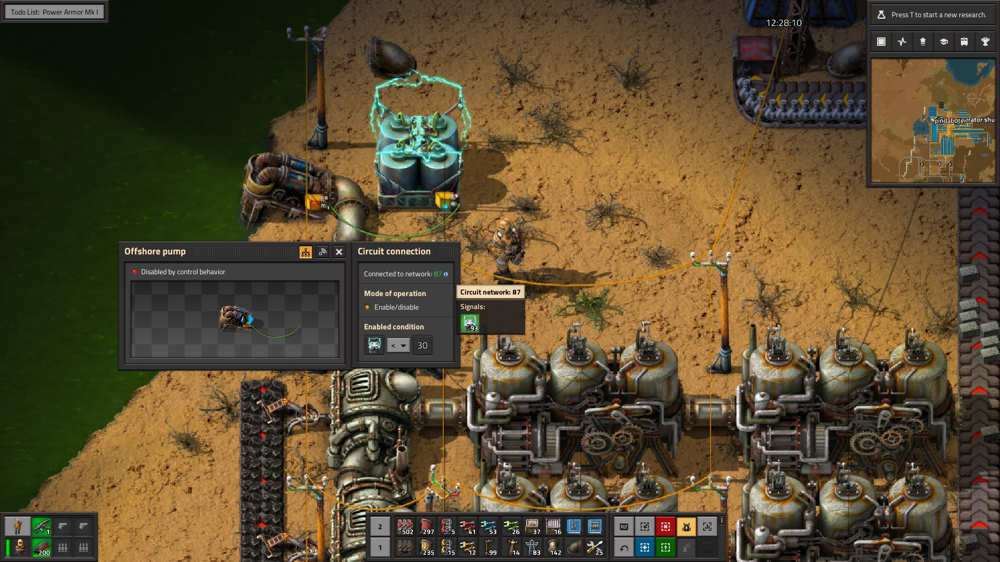
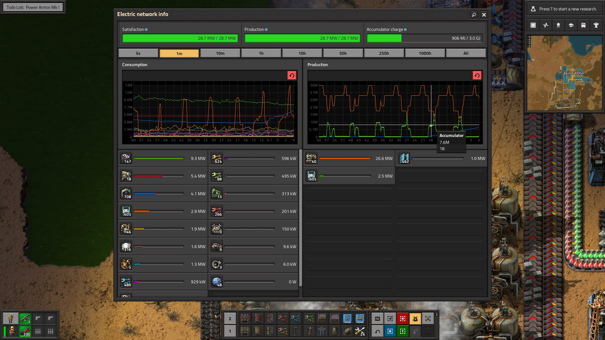
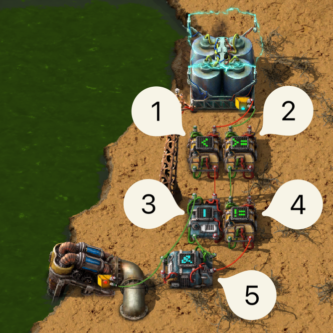

# Our goal

In Factorio, when you start building solar panels, you will quickly start to resent the coal power
plants constantly burning fuel when they shouldn’t be. Let’s assume you have
[accumulators](https://wiki.factorio.com/Accumulator) to store the power your solar panels provide,
and that you have enough to get you through the night. Most of the time, at least.

The accumulators provide the current charge percentage as a signal, so like the good Factorio
engineer you are, you connect your accumulator to your
[offshore pump](https://wiki.factorio.com/Offshore_pump) and set it to enable only when the
accumulators are below some charge level. Luckily all accumulators in a power network always have
the same amount of charge.

This works, but this results in the power level hovering around 30%, with the steam engines
flickering on and off as the accumulators charge and discharge.

We can do better. We can have the offshore pump turn on, and then have it run until it reaches a
certain percentage—say 80%. We can already turn the offshore pump on, but how do we decide when to
shut it off again?

Factorio offers several [combinators](https://wiki.factorio.com/Combinators) to work with basic
signal logic. So what we could do is turn the pump on and then use an `AND` gate to turn the pump
off when the pump is on and the accumulator charge is over 80%.

Unfortunately, neither the offshore pump, the boiler nor the steam turbines provide us with a
signal[^signals] to tell us whether they’re on or off.

# Flip-flops

Enter [flip-flops](<https://simple.wikipedia.org/wiki/Flip-flop_(electronics)>). Flip-flops, also
known as latches, are electronic circuits with two possible stable states and two inputs. This means
they 'remember' their state, which is why they are building blocks of computer memory.

Please note that I do not have any electrical engineering background, and as such I will be talking
about these from a programming perspective, not an electrical one. With that out of the way:

Flip-flops have two inputs, and one output. The inputs are called ‘set’ and ‘reset’. When a signal
is sent to the _set_ input, the input turns on if it wasn't already. If you then send a signal to
the _reset_ input, it turns of again.

For a visual explanation by one of my favourite YouTubers Sebastian Lague, please watch this
timestamped video called [How Do Computers Remember?](https://youtu.be/I0-izyq6q5s?t=73).

# Implementing a flip-flop in Factorio

With Factorio’s combinators, we have all the tools to build our own flip-flop. We’re setting out to
remember whether the offshore pump is providing water to our coal generator, to be able to determine
when to shut it off again.

[//]: <> "TODO: Add numbers to the combinators"

The accumulator is sending a signal to two arithmetic combinators.

[//]: <> "TODO: Fix in-line code in (numbered) lists"

1. The signal sent over red wire is sent to a decider combinator that outputs 1 when the signal is
   `<` 30%, this is our `set` signal.
2. The signal sent over the green wire is sent to a decider combinator that outputs 1 when the
   signal is `>=` 80%, this is our `reset` signal.
3. This arithmetic combinator performs a boolean `OR` (`|`) on the `set` signal and the output of
   this flip-flop. This is what causes the steady state.
4. This decider combinator takes the reset signal and performs a boolean `NOT` (`!=`) on the signal.
   This way, if no signal is sent to the `reset` input, we send a `1` and vice versa.
5. This final decider combinator performs a boolean `AND` on the output of the `set` and the
   (`NOT`ed) `reset` signal. As long as the signal is `set` and `NOT reset`, we output `1`.

The final step is to send the output of that final decider combinator to our offshore pump, and
voilà! We have successfully buffered our signal!

[^signals]:
    A nice overview of which devices send and/or receive which signals can be found
    [here](https://wiki.factorio.com/Circuit_network#Devices).
