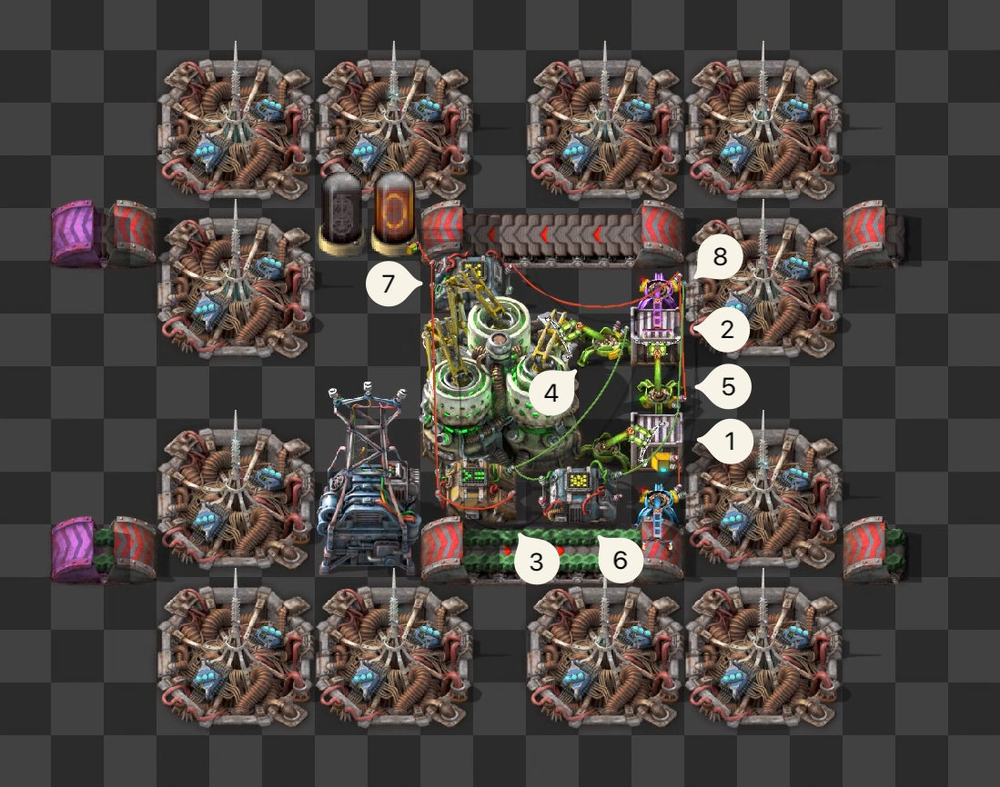

The [Kovarex enrichment process](https://wiki.factorio.com/Kovarex_enrichment_process) is a very
interesting recipe in Factorio. Most recipes in the game take a certain amount of one or more
ingredients and output a single product.

The Kovarex enrichment process, however, turns 40
[uranium-235](https://wiki.factorio.com/Uranium-235) (from here on ‘happy rocks’) and 5
[uranium-238](https://wiki.factorio.com/Uranium-238) (from here on ‘sad rocks’) into 41 bright rocks
and 2 sad rocks. It converts 3 sad rocks into 1 happy rock,



The process is primed with 40 happy rocks. Since we get one or two happy rocks more out of the
process than we put in, we want to have a system that ensures _only_ excess rocks are taken out.

Obviously, we could just take all the rocks—both happy and sad—through a belt and route them back to
an input. But that would be boring, so let’s use circuits instead.

1. This chest contains everything needed for the process; 40 happy rocks and a few sad rocks.
   Because inserters will fill the centrifuge to 80 happy rocks, this means there are a total of 120
   happy rocks in this system.
2. This chest is where the centrifuge will output the products.
3. The counter keeps track of how many happy rocks are in the system. We don’t care about the amount
   of sad rocks.
4. This inserter sends the hand contents to the counter (3). All stack inserters are set to have a
   stack size of 10. This will become important later.
5. This inserter sends the hand contents to the inverter (6). It is also set to not work when the
   signal from the modulo combinator (7) is 0.
6. The `*` arithmetic combinator inverts the incoming signals by multiplying them by -1. We use
   this to subtract from the counter.
7. The `%` arithmetic combinator divides the signal by 10 and outputs the remainder. This operation
   is called modulo, and is used to determine when there is a value that is not exactly divisible
   by 10.
8. This final filter inserter—as opposed to stack inserter 5—will only work when the signal from the
   modulo combinator (7) is 0. This means that it will only take out happy rocks when the counter is
   not divisible by 10, i.e. when there are more than 120 happy rocks in the system.

The centrifuge finishes, stack inserter 4 takes out 4 stacks of 10 happy rocks and one stack of 2
happy rocks. The counter modulo 10 is now at 2. Filter inserter 5 now stops, since the modulo
combinator is not 0, but for the same reason filter inserter 8 now takes out happy rocks until the
counter modulo 10 is 0 again.

> Question: Can't we just read the contents of (2) instead of using a counter?
