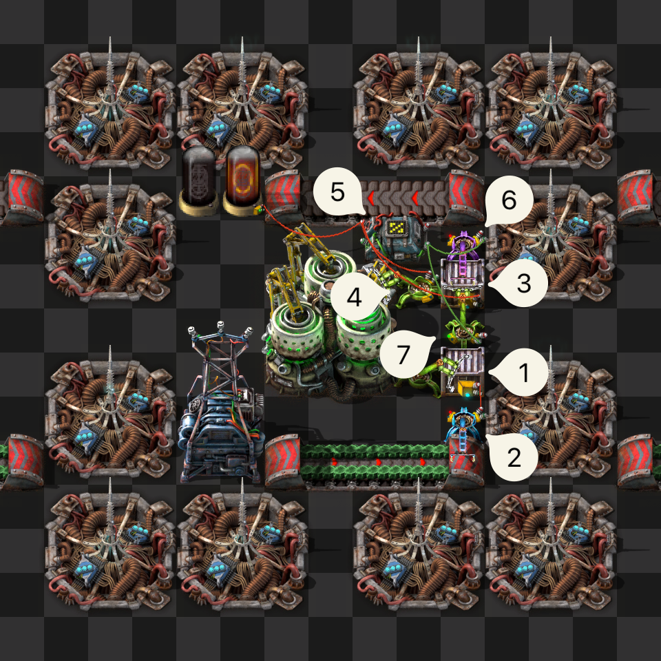

The [Kovarex enrichment process](https://wiki.factorio.com/Kovarex_enrichment_process) is a very
interesting recipe in Factorio. Most recipes in the game take a certain amount of one or more
ingredients and output a single product.

The Kovarex enrichment process, however, turns 40
[uranium-235](https://wiki.factorio.com/Uranium-235) (from here on ‘happy rocks’) and 5
[uranium-238](https://wiki.factorio.com/Uranium-238) (from here on ‘sad rocks’) into 41 bright rocks
and 2 sad rocks. It converts 3 sad rocks into 1 happy rock,



The process is primed with 40 happy rocks. Since we get one or two happy rocks more out of the
process than we put in, we want to have a system that ensures _only_ excess rocks are taken out.

Obviously, we could just take all the rocks—both happy and sad—through a belt and route them back to
an input. But that would be boring, so let’s use circuits instead.

1. This chest contains everything needed for the process; 40 happy rocks and a few sad rocks.
   Because inserters will fill the centrifuge to 80 happy rocks, this means there are a total of 120
   happy rocks in this system.
2. This inserter inserts a limited amount of sad rocks into chest ① so that there’s always enough to
   convert into happy rocks.
3. This chest is where the centrifuge will output its products. Its contents are sent to modulo `%`
   arithmetic combinator ⑤.
4. Inserters only ever take out one type of item at a time, so by limiting the hand size to 10, we
   know for sure that happy rocks will be taken out 10 at a time. This is important.
5. This modulo `%` arithmetic combinator divides the signal by 10 and outputs the remainder. The
   output is 0 when the signal is divisible by 10.
6. This filter inserter only takes out happy rocks when the output of combinator ⑤ is greater
   than 0.
7. This stack inserter takes out both happy rocks and sad rocks if _happy rocks mod 10 = 0_,
   according to combinator ⑤. When combinator ⑤ outputs 1 or more, this inserter is disabled, and
   filter inserter ⑥ takes over.

So, chronologically:

The centrifuge finishes, stack inserter ④ takes out the sad rocks, 4 stacks of 10 happy rocks and
one stack of 1 happy rock. The sad rocks are immediately passed along as 0 mod 10 is 0. The
stacks of 10 are also passed along, since _10 mod 10 is_ also 0.

After the last stack of happy rocks is put into the chest, there is a non-divisible-by-ten amount of
happy rocks, so filter inserter ⑦ stops and filter inserter ⑥ starts taking out happy rocks until
the amount of _happy rocks in chest ③ mod 10_ is 0 again.

There is one little snag. When there is one happy rock in chest ③, it will send a signal of 1 to
combinator ⑤, which will then send a signal of 1 to filter inserter ⑦ the next frame. But by then,
the happy rock has already been taken out by filter inserter ⑦. This is easily solved by reading the
hand contents of stack inserter ④ and sending that signal with `hold` (not `pulse`) to combinator ⑤
as well, effectively making its contents an extension of chest ③.

We now have a closed system that only takes new sad rocks as they are needed and only ever outputs
the excess happy rocks.
