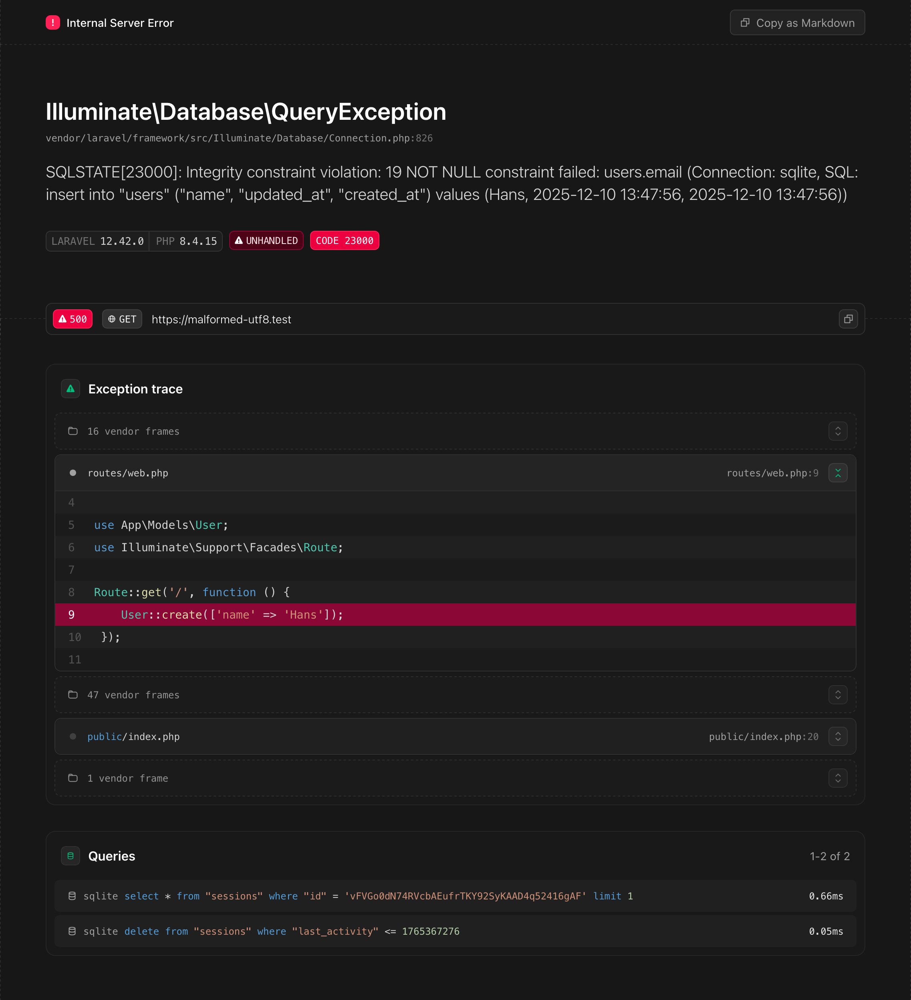
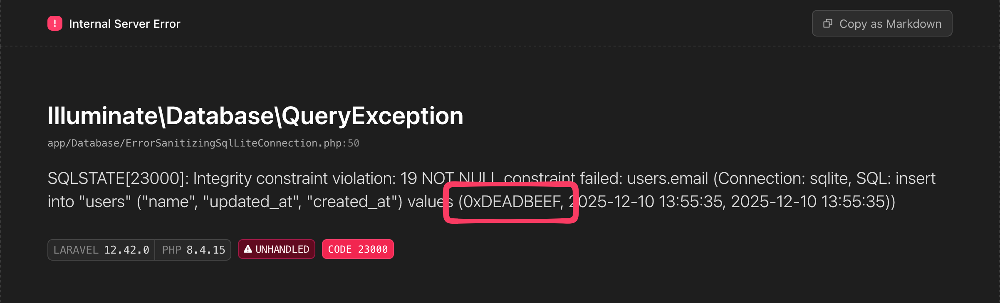
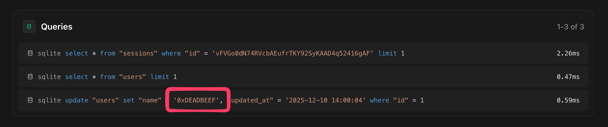

> Malformed UTF-8 characters, possibly incorrectly encoded

If you have ever seen this exception, chances are that you are saving byte strings to the database
using a package like [`laravel-model-uuid`](https://github.com/michaeldyrynda/laravel-model-uuid).

A byte string is arbitrary byte data formatted as a string; bytes, with `string` as their vehicle.
This is great for efficiently storing small amounts of data, but as it’s arbitrary data, it’s not
valid [UTF-8](https://en.wikipedia.org/wiki/UTF-8).

Problems arise when you try to display this data in a web browser or try to parse it somehow.

Normally speaking, you wouldn’t. So why do we see this Symfony exception page?

## Cause

Laravel has a beautiful exception page that displays a lot of useful information about the exception
that was thrown; the exception class and message, the stack trace, request and session details,
and—relevant to what we’re doing—all SQL queries that have occurred during that request up until the
point where the exception was thrown, along with their bindings[^1].

If the exception being rendered is a database exception, the relevant SQL query is also included in
the message.



But what happens if this page itself fails to render?

Whenever something goes wrong, an exception is thrown. Relevant data is collected and written to a
log, sent to an error reporting service, a webhook for your chat service is triggered, whatever you
have configured `config/logging.php`. And the exception page is rendered.

If—somewhere in the request lifecycle—a byte string is involved in a database operation, this will
also be included in the data being passed around, and that throws a spanner in the works.

At some point, the SQL query and its bindings will be parsed as JSON, and that function will fail,
because this byte string is—indeed—not valid UTF-8. Now a new exception is thrown. That exception
will be rendered as a Symfony exception page; a fallback for when the original exception page fails
to render. And the original exception will be lost.

## Solution

To solve this issue, we need to turn the byte strings into something that is actually valid UTF-8
before it is passed to something that expects valid UTF-8. There are three problems we need to
solve:

- The bindings in a `QueryException`’s message need to be sanitized
- The bindings in the Queries section of the exception page need to be sanitized
- A bonus problem that we’ll tackle later

Let’s dive in.

### Query exceptions

A `Illuminate\Database\QueryException` is thrown whenever a database operation fails. The message
contains the SQL query and its bindings. We can trigger one by trying to create a user where a
non-nullable field isn’t specified.

```php
// No email specified
$user->create(['name' => hex2bin('deadbeef')]);
```

We will go right to the source, the place where the exceptions are thrown, and the data is passed to
them: `Illuminate\Database\Connection::runQueryCallback`. All this method does is run the query
callback, and if an exception is thrown, it will be re-thrown as a `QueryException`.

If this happens, we can sanitize the bindings before re-throwing the exception:

```php {caption="The method is functionally identical, except for passing sanitized bindings to the QueryException" linenos=inline hl_lines=["15-27"] wide=true}
namespace App\Database;

use Closure;
use Exception;
use Illuminate\Database\MySqlConnection;
use Illuminate\Database\QueryException;
use Illuminate\Database\UniqueConstraintViolationException;

class ErrorSanitizingMySqlConnection extends MySqlConnection
{
    protected function runQueryCallback($query, $bindings, Closure $callback): mixed
    {
        try {
            return $callback($query, $bindings);
        } catch (Exception $e) {
            // Sanitize bindings before creating the exception
            $sanitizedBindings = sanitize_bindings($this->prepareBindings($bindings));

            // […]

            throw new QueryException(
                connectionName: (string) $this->getName(),
                sql: $query,
                bindings: $sanitizedBindings,
                previous: $e
            );
        }
    }
}
```

We can’t override `Illuminate\Database\Connection::prepareBindings` (line 17), as that would
sanitize ALL bindings, including those that would successfully be inserted into the database.

As `runQueryCallback` is defined on `Illuminate\Database\Connection`, without any ways to hook into
it, we need to override the class for the database connection we are using, e.g.,
`Illuminate\Database\MySqlConnection`.

We sanitize the bindings with a helper that we will reuse later:

```php {caption="Each non-UTF-8 string binding is replaced with its hexadecimal representation"}
function sanitize_bindings(array $bindings): array
{
    return array_map(function ($binding) {
        if (! is_string($binding) || mb_check_encoding($binding, 'UTF-8')) {
            return $binding;
        }

        return '0x'.bin2hex($binding);
    }, $bindings);
}
```

Now we need to make Laravel use our custom connection class.

Laravel is built with dependency injection as a core part of its architecture. This means that we
can swap out nearly any functionality the framework offers for our own implementation, including the
class used to manage database connections. We can do this by adding the following to
`App\Providers\AppServiceProvider::boot`:

```php {caption="Registering the custom connection using dependency injection"}
Connection::resolverFor('mysql', function ($connection, $database, $prefix, $config) {
    return new ErrorSanitizingMySqlConnection($connection, $database, $prefix, $config);
});
```

And with these changes
([source](https://github.com/pindab0ter/malformed-utf8-demo/commit/ab93e2e653f1d1b0a656bd123026dcd68b2d9abe)):
Success! The exception renders correctly:



---

### The Queries section

A `QueryException`’s message is not the only place where the SQL query and its bindings are
displayed. The Queries section of the exception page also displays them. So something like this will
still trigger the “Malformed UTF-8 characters” error:

```php {caption="Successfully executed query will end up in the Queries section of the exception page"}
User::find(1)->update(['name' => hex2bin('deadbeef')]);

throw new Exception('Whoops!');
```

To solve this, we need to override the method responsible for rendering the exception. Or to be more
precise, the method that generates the data for the Queries section.

```php {caption="The bindings are sanitized for every query caught by the listener" hl_lines=["12-24"] linenos=inline wide=true}
namespace App\Exceptions\Renderer;

use Illuminate\Foundation\Exceptions\Renderer\Exception;

class ConfigurableFrameException extends Exception
{
    public function applicationQueries(): array
    {
        $queries = $this->listener->queries();

        return array_map(function (array $query) {
            $sql = (string) $query['sql'];

            $sanitizedBindings = sanitize_bindings($query['bindings']);

            foreach ($sanitizedBindings as $binding) {
                $result = match (gettype($binding)) {
                    'integer', 'double' => preg_replace('/\?/', (string) $binding, $sql, 1),
                    'NULL' => preg_replace('/\?/', 'NULL', $sql, 1),
                    default => preg_replace('/\?/', "'{$binding}'", $sql, 1),
                };

                $sql = (string) $result;
            }

            return [
                'connectionName' => $query['connectionName'],
                'time' => $query['time'],
                'sql' => $sql,
            ];
        }, $queries);
    }
}
```

This whole method is an exact copy of the parent method, except for the sanitized bindings
([source](https://github.com/pindab0ter/malformed-utf8-demo/commit/ab93e2e653f1d1b0a656bd123026dcd68b2d9abe)).



With that, all places where the SQL query and its bindings are displayed are sanitized and will not
fail with a Malformed UTF-8 characters error anymore.

---

### Bonus problem: Stacks

In fixing one problem, we have created another:


Because we have implemented our own exception renderer, the stack trace will now show our custom
`Connection` class as the first non-vendor class in the trace. While correct, it is not very
helpful, as it masks the place where the original error occurred.

We can fix this, but it is a little more involved. The process is as follows:

- When an exception is thrown, `Illuminate\Foundation\Exceptions\Renderer\Renderer` takes a request
  and a throwable and prepares the data to render the exception page: an instance of
  `Illuminate\Foundation\Exceptions\Renderer\Exception`
- It takes the stack trace frames and turn them into instances of
  `Illuminate\Foundation\Exceptions\Renderer\Frame`
- 

  ```php {hl_lines=["11-20"] caption="Frames are grouped by whether they are considered a vendor frame" wide=true linenos=inline}
  /**
   * Get the exception's frames grouped by vendor status.
   *
   * @return array<int, array{is_vendor: bool, frames: array<int, Frame>}>
   */
  public function frameGroups()
  {
      $groups = [];

      foreach ($this->frames() as $frame) {
          $isVendor = $frame->isFromVendor();

          if (empty($groups) || $groups[array_key_last($groups)]['is_vendor'] !== $isVendor) {
              $groups[] = [
                  'is_vendor' => $isVendor,
                  'frames' => [],
              ];
          }

          $groups[array_key_last($groups)]['frames'][] = $frame;
      }

      return $groups;
  }
  ```



- Then finally, the `x-laravel-exceptions-renderer::trace` view component will render the grouped
  frames.

So the best way to fix this is to tackle the problem at the source: _Which classes are considered
vendor classes?_

To do this, we need to override the `isFromVendor` method of the `Frame` class, we need to override
the `frames` method of the `Exception` class to use the custom `Frame`, and we need to override the
`render` method of the `Renderer` class to use our custom frames. Feel free to inspect the code
changes here:
[Treat custom SQL connection as vendor class](https://github.com/pindab0ter/malformed-utf8-demo/commit/200b05d9c04f476d21d90fbf1f701022ffade1a8)

```php {hl_lines=["7-10"] wide=true caption="The method responsible for determining whether a frame is from a vendor class"}
class ConfigurableFrame extends BaseFrame
{
    public function isFromVendor(): bool
    {
        return ! str_starts_with($this->frame['file'], $this->basePath)
            || str_starts_with($this->frame['file'], join_paths($this->basePath, 'vendor'))
            || array_any(
                config('app.classes_treated_as_from_vendor', []),
                fn ($ignored) => $this->class() === $ignored || ($this->frame['class'] ?? null) === $ignored
            );
    }
}
```

The repository is available on GitHub: [pindab0ter/malformed-utf8-demo](https://github.com/pindab0ter/malformed-utf8-demo)

[^1]:
    Bindings are the values that are bound to the SQL query. Instead of the parameter placeholder
    `?`, the actual value will be displayed. For example:

    ```sql
    -- With parameter placeholder:
    select * from "users" where "users"."email" = ?

    -- With bindings:
    select * from "users" where "users"."email" = "some.user@example.com"
    ```
