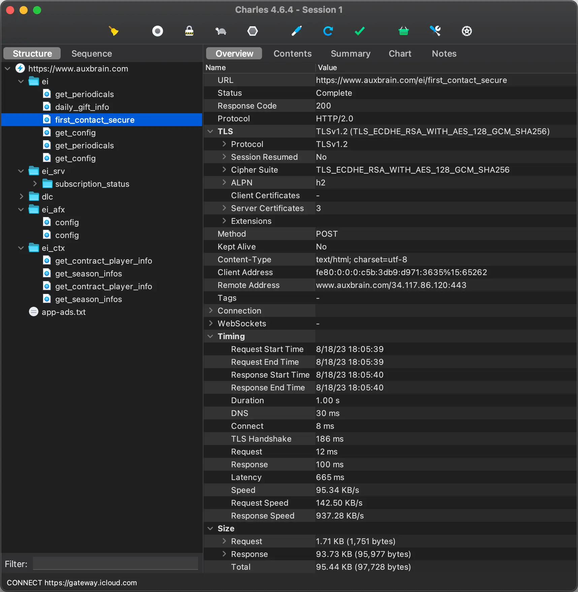

To make a Discord bot to help organize co-op teams in Egg, Inc., I was going to need to get data from the game.
There are no documented APIs, so I was going to have to reverse engineer the game’s network traffic.

## Charles Proxy

I used [Charles Proxy](https://www.charlesproxy.com/) to intercept the network traffic between the game and the server.
You can even use it
to [intercept encrypted HTTPS traffic from your iPhone](https://www.charlesproxy.com/documentation/using-charles/ssl-certificates/).
Perfect!

Whenever I opened the game, I would see a few requests and one of them had a massive response of unintelligible data.
The first thing I found out was that it was Base64-encoded. After decoding, it was still mostly unintelligible, but
slightly less so. It was a binary format, so I grabbed a hex editor and started looking for patterns.



> Please note that the creator of Egg, Inc. have had to deal with cheaters in the past. Security has been much improved
> since then.
>
> B.O.C.K. has only ever sent read-only requests. Please be a decent human being and don’t cheat.

## Protobuf

As you can see in the cover image, there are some repeating patterns. I started to figure out that I could tell what
certain values where, but not what those values meant.

After a while, I realized that the data was probably encoded using [Protocol Buffers](https://protobuf.dev). This is a
binary format for serializing structured data. It competes with the likes of JSON and XML, but is much more compact and
faster to parse. However, it is not human-readable.

The missing link here is a Protocol buffer definitions file. These `.proto` files contain the structure of the data,
called *messages*. So I started digging through the binary data and tried to make sense of it.

```protobuf
message msg7 {
  int32 unknown1 = 1; // 17 for me, highest egg reached or something?
  uint64 ge_total = 2;
  uint32 ge_spent = 3;
  uint64 soul_eggs = 4;
  double prestige_earnings = 5;
  double lifetime_earnings = 6;
  uint32 piggy_bank = 7;
  uint32 unknown8 = 8;
  repeated name_level epic_research = 9;
  double unknown10 = 10; // looks like a timestamp
  repeated name_level newspaper = 11;
  double unknown12 = 12; // looks like a timestamp
  double unknown13 = 13;
  double video_expire_time = 14; // looks like a timestamp
  repeated name_level achievement = 15;
  uint32 unknown16 = 16;
  uint32 unknown17 = 17;
  repeated uint32 unknown18 = 18; // "highest amount of chickens obtained on that egg"
  repeated uint32 unknown19 = 19; // "level of trophy obtained for their respective eggs"
  uint32 unknown20 = 20; // related to daily gift "day"
  uint64 unknown23 = 23;
  uint32 unknown24 = 24;
  uint32 unknown25 = 25;
  double unknown26 = 26;
  double unknown27 = 27;
}
```

The quick wins were numbers that I knew had to be a certain value. For example, the amount of Golden Eggs, Soul Eggs,
the amount of chickens on the farm, levels of research, etc. Other values were more difficult to figure
out. `uint32 unknown19` turned out to be a list of the highest collected trophy for each egg. It's safe to say I spent a
while figuring out what values were relevant.

For reference, my most recent version of this file has 1348 lines.

And the best part?

It took me months to figure out that I could just get the file from the game’s APK and have all of the messages
with the correct names and types.